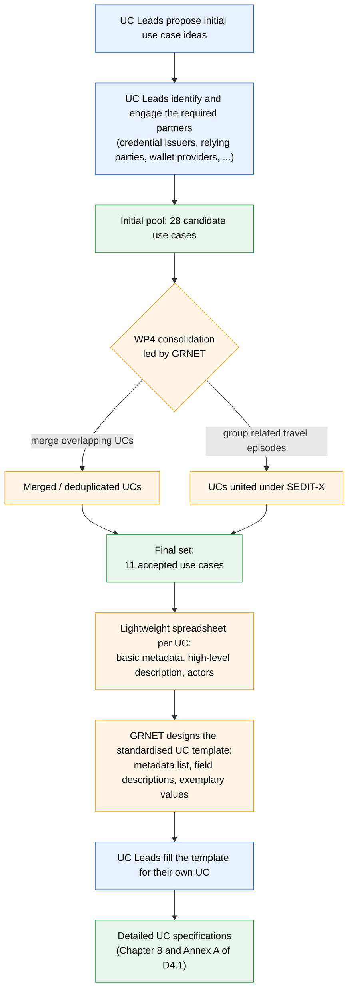

# Methodology

This chapter describes how the content of D4.1 was produced during the T4.2 stock-taking phase of WP4. Its purpose is to make the working method behind the deliverable visible, so that readers can assess the rigour and completeness of the specifications that follow, and so that other Large Scale Pilots can, if they wish, replicate or adapt the approach.

The methodology behind D4.1 is the combined result of three activities that ran in parallel during the stock-taking phase. First, a **consolidation activity** through which the initial ideas contributed by the UC leads were turned into a coherent set of 11 accepted use cases. Second, a **stakeholder engagement activity** through which UC leads identified and involved the partners that each use case needs (credential issuers, relying parties, wallet providers, and others). Third, a **specification activity** through which the use case descriptions were progressively enriched, first via a lightweight metadata spreadsheet and then via a standardised specification template designed by GRNET and filled by each UC lead.

The diagram below summarises the process that led from the initial UC ideas to the detailed specifications presented in this deliverable. Blue steps are activities owned by the individual UC leads; orange steps are coordination activities owned by GRNET acting as the WP4 coordinator; green steps represent the three state transitions of the UC set (initial pool, final accepted set, and detailed specifications).

The chapter is organised as follows. Section 3.1 describes the stock-taking and analysis approach, explaining how the 11 use cases were arrived at and how the analysis was structured. Section 3.2 reports on stakeholder involvement, with a dedicated subsection for each of the 11 use cases so that the reader can trace, for every UC, who was consulted and by which means. Section 3.3 lists the sources and tools that supported the work, again broken down per use case to make the evidence base explicit.
