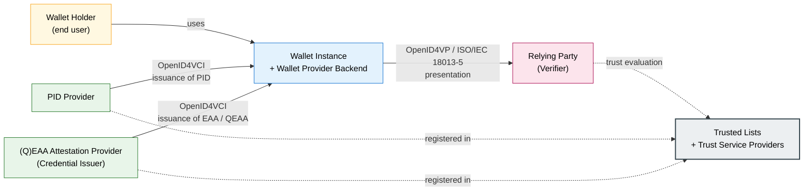

## EUDIW Architecture and Reference Framework (ARF) Alignment

This section describes how WP4 implementations align with the **Architecture and Reference Framework (ARF)** for the European Digital Identity Wallet. Its purpose is to establish, once for the whole pilot, which ARF components are exercised by the WP4 use cases, which protocol profiles apply, and which ARF version is the baseline against which D4.1 is written. The per-UC subsections (7.1.1 through 7.1.11) record UC-specific ARF alignment notes, where the use case extends or refines the common baseline.

**Introduction to ARF, and the need for alignment with WP4**

The ARF is the architectural reference document for the EUDIW ecosystem, maintained by the eIDAS Expert Group under the responsibility of the European Commission. It defines the components of the ecosystem (such as the wallet instance, the PID provider, the attestation provider, and the relying party), the interactions between them (issuance, presentation, trust evaluation), the data models for credentials, and the protocol profiles that bind the components together. The ARF evolves through successive versions and is complemented by the technical Implementing Acts adopted under eIDAS 2.0 (see Section 6.1).

WP4 acts as a consumer of the ARF: every UC implementation in WP4 must be conformant with an ARF version selected at the project level, and with the protocol profiles that WP2 selects on top of the ARF for the APTITUDE consortium. This positioning has two consequences for the rest of this section:

1. The components and protocols listed below are the ARF components and protocols that WP4 use cases use, named here so that the per-UC subsections can refer to them without redefinition.
2. Where the ARF or the WP2 profiles evolve during the project, Task T4.3 will assess if and how this section needs to be revised in step. 

**ARF version baseline**

The ARF version against which D4.1 is written is the version selected by WP2 as the baseline for APTITUDE, frozen at the closure of T4.2 and recorded in the WP2 outputs (see Section 2.3.1). The exact version identifier is reported by WP2 in its technical profile documentation rather than restated here, both because the WP2 output is the authoritative reference and because it may evolve through minor updates during the project. The per-UC subsections of Section 7.1 indicate the ARF profile they use; where two UCs use different ARF profile variants, the difference is recorded explicitly so that interoperability tests on the WP2 testbed can target the right combination.

**ARF components used in WP4**

The WP4 use cases exercise the following ARF components. The actor categories defined in Chapter 8 are in parentheses next to each component, so that the technical and the actor views of the ecosystem can be aligned.

* **Wallet Instance (Wallet Holder, on a device controlled by the Wallet Provider).** The piece of software running on the wallet holder's device that holds, manages, and presents credentials. WP4 does not develop the wallet instance; it consumes wallet instances produced by participating Member States.
* **Wallet Provider Backend (Wallet Provider).** The infrastructure operated by the wallet provider to support wallet activation, secure storage, and the interfaces with the PID provider and attestation providers. As with the wallet instance, WP4 consumes this component rather than producing it.
* **PID Provider (PID Provider).** The infrastructure operated by the national PID issuing authority that issues the Person Identification Data into the wallet at the highest level of assurance. Every WP4 UC that verifies the identity of a wallet holder relies on a PID provider in the wallet holder's Member State.
* **(Q)EAA Attestation Provider (Credential Issuer).** The infrastructure operated by a credential issuer that issues sector-specific Electronic Attestations of Attributes (qualified or non-qualified) into the wallet. Most WP4 use cases include one or more attestation providers.
* **Relying Party (Verifier).** The infrastructure operated by an organisation that verifies credentials presented from the wallet, in order to grant access to a service. Every WP4 UC includes at least one relying party.
* **Trust Service Providers and Trusted-List Operators.** Components that underpin the cryptographic and trust-chain validation of the credentials, in line with Implementing Regulation (EU) 2024/2980. Section 7.5 documents how WP4 relying parties consume the trusted lists; the present section limits itself to placing these components within the ARF picture.

**Protocol profiles applied across WP4**

WP4 use cases apply a small and consistent set of protocol profiles, in line with the Implementing Acts and with the WP2 technical profiles. The profiles named here are exercised by every UC unless a per-UC subsection records a deviation.

* **OpenID4VCI** (OpenID for Verifiable Credential Issuance) is used for the issuance flows between an attestation provider and the wallet instance. WP4 uses OpenID4VCI for the issuance of EAAs and QEAAs, with the WP2-selected profile.
* **OpenID4VP** (OpenID for Verifiable Presentation) is used for the presentation flows between the wallet instance and a relying party. WP4 uses OpenID4VP both for remote (web-mediated) presentations and, where required, with the proximity bindings.
* **ISO/IEC 18013-5 (mdoc) bindings** are used for the proximity verification flows. The wallet instance and the relying party communicate over a short-range channel, and the credential is exchanged in mdoc format. WP4 uses ISO/IEC 18013-5 at airport gates, hotel kiosks, campus turnstiles, stadium entries, and ferry boarding lanes.
* **SD-JWT VC** is used as the JSON-based credential format for remote and web-mediated flows. WP4 uses SD-JWT VC for online hotel booking, remote ETA application, and student-fare eligibility checks within online ticketing.

The choice between mdoc and SD-JWT VC for a given UC is documented in the credential inventory of Section 7.2 and refined in the per-UC subsections of 7.1, since the ARF profile determines which serialisation a relying party must support at a given touchpoint.

### A simplified ARF view of a WP4 interaction

The diagram below sketches a generic WP4 interaction at the level of ARF components, with the OpenID4VCI and OpenID4VP labels on the relevant arrows. The diagram is intentionally generic: it abstracts away the sector specifics of any individual UC and shows the components that recur across all 11 UCs. The per-UC subsections refine this view with the specific actors, credentials, and touchpoints of each use case.

Sections **7.1.1** to **7.1.11** record, for each UC, the ARF components actually exercised, the protocol profiles applied, the data models used (mdoc, SD-JWT VC, or both), and any UC-specific notes that an implementation team will need during T4.3.

