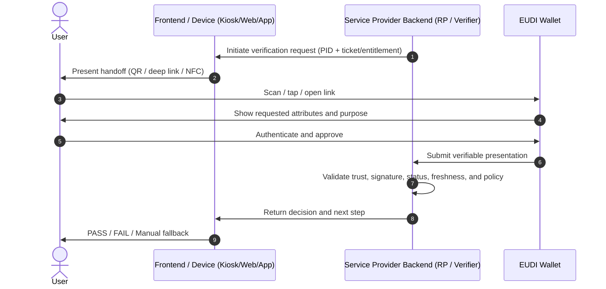
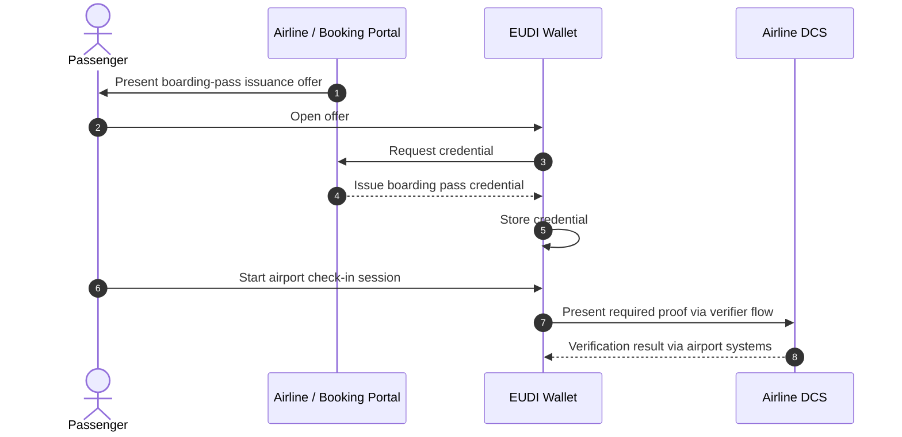
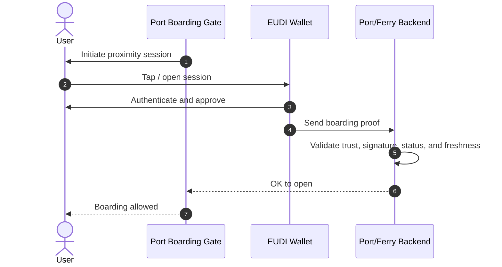
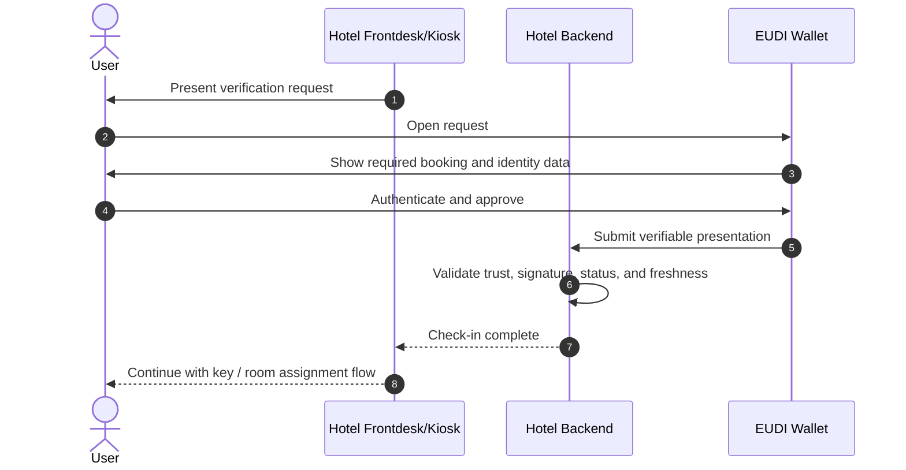
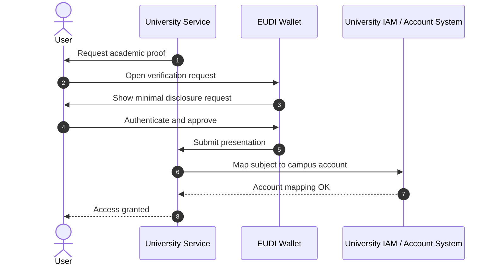

# Annex A — UC 3: Seamless Digital Traveller Experience (SEDIT-X) (UAegean)

## Use Case Summary

The **Seamless Digital Traveller Experience (SEDIT-X)** use case demonstrates how the **EUDI Wallet** can support a continuous, privacy-preserving, and cross-sector traveller journey spanning **air transport, urban mobility, ferry transport, hospitality, and university access**.

The use case is designed around the idea that the traveller should be able to rely on the wallet as a common interaction channel for identity, travel entitlements, payments, accessibility-related support, and academic access, rather than repeatedly presenting paper documents, re-entering data, or switching between disconnected applications and operational systems.

SEDIT-X focuses primarily on travellers moving within the **Schengen area**, while also considering the needs of **ERASMUS / ERUA students** and **travellers with disabilities**, thereby showcasing an inclusive-by-design and cross-border mobility scenario.

The use case unfolds in five connected episodes:

1. **Episode 1 – Smart Airport (Thessaloniki Airport):** use of the EUDI Wallet for identity verification, boarding-pass presentation, optional biometric **1:1 verification**, and selected payment interactions across airport touchpoints.
2. **Episode 2 – Urban Mobility (Athens):** wallet-supported payment for onward city transport, treated as a lighter episode in the present specification.
3. **Episode 3 – Ferry Transport (Piraeus or Rafina):** issuance and verification of ferry travel credentials, discount entitlements, and proximity-based boarding.
4. **Episode 4 – Hospitality:** wallet-supported booking identification, booking-reference issuance, selective disclosure of hotel registration data, and self-service or assisted digital check-in/check-out.
5. **Episode 5 – University Campus Access:** use of academic credentials from the wallet to support federated access to university services, facilities, and events.

Across these episodes, SEDIT-X aims to validate how wallet-based identity, travel, entitlement, payment, and academic-access capabilities can replace fragmented, document-heavy, and repeatedly manual traveller processes with a more secure, user-centric, and interoperable experience.

More specifically, the use case focuses on:

- **selective disclosure** of only the data needed at each step;
- **reduced administrative burden** for travellers and service providers;
- **cross-sector interoperability** across transport, hospitality, and higher education;
- **accessibility and equal treatment** for travellers with disabilities;
- **privacy-preserving verification**, including **1:1 biometric verification** in airport scenarios where applicable; and
- **wallet-mediated payments** where the pilot includes payment-enabled steps.

---

## UC User Story

### Persona 1 – Flight Passenger

As an EU citizen, I want to store my identity credential and air-travel credentials in my EUDI Wallet, so that I can prepare my trip digitally without carrying paper documents or repeatedly entering personal data.

As an EU citizen, I want to use my EUDI Wallet at airport check-in, baggage drop-off, security, and boarding, so that my airport journey becomes faster, safer, and more convenient.

### Persona 2 – Ferry Passenger / Tourist

As a traveller continuing my journey by ferry, I want to receive my ferry boarding credentials in the same wallet environment and use them for fast ticket validation and boarding, so that I can move across transport modes without changing process or identity channel.

As a traveller, I want verified student or disability discounts to be applied automatically based on wallet-held credentials, so that ticketing is seamless, trusted, and fair.

Where I travel with a vehicle, I want the corresponding vehicle-related credential to be usable in the same wallet-supported journey, so that booking and boarding remain integrated.

### Persona 3 – Hotel Guest

As a hotel guest, I want to identify myself and check in or check out using my EUDI Wallet with selective disclosure of only the necessary attributes, so that my stay is more paperless, privacy-preserving, and efficient.

As a hotel guest, I want my booking reference to be available through the wallet and reusable during the stay, so that check-in, room access, and related hotel services can progressively become more automated.

### Persona 4 – Traveller with Disabilities

As a traveller with disabilities, I want to selectively disclose verified accessibility-related credentials from my wallet, so that service providers can offer the appropriate support without requiring me to expose unnecessary personal or medical information.

### Persona 5 – Student at Destination

As a student travelling to the University of the Aegean or another ERUA institution, I want to use my academic credentials from the wallet for campus access and student services, so that I can integrate smoothly into academic life without extra registration steps.

### Persona 6 – Mobile-First Traveller

As a digitally native traveller, I want to use the EUDI Wallet as a one-stop interaction channel for identity, travel entitlements, and selected payments, so that my journey is simpler, faster, and more privacy-preserving.

---

## Actors

### Credential Issuers

- **National PID issuers / eID authorities** issue the Person Identification Data (PID) credential used as the root identity credential in the journey.
- **Airline / airline booking platform** issues the boarding pass credential and related air-travel credentials.
- **Airport-side issuer functions** may issue airport-specific credentials, such as a biometric QR credential in the airport pilot flow.
- **Cyclades Fast Ferries / participating travel agencies** issue ferry boarding credentials and related ticketing artefacts.
- **Travel agent / booking platform / DMC** support the hotel-booking process and trigger issuance of a booking reference or booking credential for hospitality flows.
- **Hotel-side issuer functions** may issue stay-related artefacts such as room-access, proof-of-stay, or other stay credentials in more advanced variants.
- **University of the Aegean / ERUA institutions** issue academic credentials used for student status and university access.
- **Competent authorities / recognised organisations** issue accessibility or disability attestations.
- **Payment ecosystem actors / PSP-side systems** support payment confirmations and e-receipts where relevant.

### Relying Parties / Verifiers

- **Thessaloniki Airport / Fraport Greece** acts as verifier across airport touchpoints.
- **Airport and airline operational systems**, including check-in, baggage, security, and gate systems, verify boarding entitlement and identity binding.
- **Cyclades Fast Ferries / port-side verification systems** verify ferry boarding credentials and ticket validity.
- **Hotel / PMS / check-in terminal** verifies booking and identity data during digital hotel check-in.
- **University service providers** verify academic credentials for access to campus services and facilities.
- **Urban mobility providers** verify payment or entitlement information where relevant.

### Intermediary / Coordination Actors

- **EUDIW Intermediary Service** acts as the main integration layer between wallet protocols and domain systems, especially in the airport, ferry, and hotel episodes.
- **Decentralized Travel Booking Network / booking-state layer** may support dynamic booking-state management and synchronisation across suppliers in parts of the use case where such capability is piloted.
- **Technology providers** may supply issuance, verification, orchestration, proximity, or integration components needed by the participating partners.

---

## Context and Preconditions

The following conditions are assumed for the use case to begin:

- The traveller has a conformant **EUDI Wallet** installed on a personal smartphone and under their sole control.
- The traveller holds a valid **PID credential** in the wallet.
- Where relevant, the traveller also holds additional credentials, such as:
  - student status,
  - disability/accessibility attestations,
  - vehicle-related credentials,
  - payment-related wallet capabilities.
- Relevant service-provider systems are connected, directly or through adapters/intermediaries, to wallet-based issuance and/or verification flows.
- For airport biometric-enhanced flows, the participating environment supports the required capture, verification, and fallback procedures.
- For hotel flows, the participating booking and hotel environments are sufficiently integrated to support booking-reference handling and on-site wallet-based verification.
- Payment integration is available for the scenarios where the pilot uses wallet-mediated payment authorisation.
- The University of the Aegean or another participating academic institution can verify the required academic credentials for campus access.
- All participating parties operate within a common trust, legal, and interoperability framework aligned with the EUDI Wallet architecture.

---

## Credentials Involved

1. **Person Identification Data (PID)**  
   A high-assurance identity credential issued by a national authority and stored in the EUDI Wallet. It is used for identity verification, binding to travel credentials, and trust establishment across the journey.

2. **Boarding Pass Credential (Air Transport)**  
   A wallet-stored verifiable credential representing the passenger’s flight entitlement. It is used at airport check-in, security, and boarding and is bound to the passenger identity according to the pilot policy.

3. **Biometric QR Credential / Airport Journey Token**  
   In one airport pilot path, an airport-issued biometric QR credential is created after prior identity and flight-entitlement verification. It is then used at airport checkpoints as a checkpoint-readable journey token.

4. **Ferry Boarding Credential**  
   A wallet-stored ferry travel credential used for ticket validation and boarding in maritime transport flows.

5. **Student Status Credential / ERUA Academic Credential**  
   A wallet credential used for verified discounts and university access.

6. **Accessibility / Disability Attestation**  
   A credential supporting selective disclosure of accessibility-related entitlements.

7. **Booking Reference / Booking Credential (Hospitality)**  
   A credential issued after successful hotel reservation creation and stored in the wallet. It is presented together with identity data during hotel check-in and supports booking retrieval and state progression.

8. **Digital Payment Credential(s) and Payment Confirmation / e-Receipt Artefacts**  
   Proofs supporting or confirming wallet-mediated payments in scenarios such as overweight baggage fees, urban mobility payments, ferry-related payments, or hospitality extras.

9. **Mobile Vehicle Registration Credential (mVRC)**  
   A wallet-stored vehicle registration credential used when a ferry booking includes a vehicle.

10. **Optional stay or access credentials**  
   In more advanced hospitality or university variants, SEDIT-X may explore additional credentials for room access, proof of stay, or service entitlements.

---

## User Journey (Business Flow of Events)

### Phase 0 – Wallet Setup and Pre-Travel Provisioning

1. The traveller installs and activates a conformant EUDI Wallet.
2. The traveller obtains a PID credential and stores it in the wallet.
3. Where applicable, the traveller also stores additional credentials such as student status, accessibility attestations, or vehicle-related credentials.
4. The traveller books the relevant transport and, where applicable, hotel services.
5. Wallet-based payment functionality is available for scenarios requiring digital payment during the journey.

### Phase 1 – Airport Journey (Thessaloniki Airport)

6. Before arriving at the airport, the traveller completes flight check-in and receives a **boarding pass credential** in the wallet.
7. Depending on the airport pilot path, the traveller may:
   - rely on **direct wallet presentation** of PID plus boarding pass; or
   - first obtain an **airport-issued biometric QR credential**.
8. At the airport check-in kiosk or desk, the traveller presents the wallet and proves identity and flight entitlement.
9. The airport or airline system validates the presented evidence and updates the operational state.
10. The traveller proceeds to baggage drop-off.
11. If the baggage is overweight, the traveller authorises payment through the wallet.
12. At security, the traveller presents the required wallet-based proof for identity and/or boarding eligibility, depending on the policy applied.
13. At the gate, the traveller presents the required credentials again for final boarding validation.
14. Where the pilot uses biometric-enhanced mode, a **1:1 biometric verification** step may be performed before the traveller is allowed to proceed.
15. Optional airport services may use verified entitlements from the wallet, for example accessibility-related support or lounge access.

### Phase 2 – Urban Mobility (Athens)

16. After arrival, the traveller uses a participating urban-mobility service.
17. In the present specification, this episode is treated at a **high level** and focuses mainly on a wallet-mediated payment interaction for a city-transport service such as a taxi.
18. The traveller proceeds to the next stage of the journey.

### Phase 3 – Ferry Transport

19. The traveller books a ferry trip via a ferry operator or participating travel agency.
20. Ferry boarding credentials are issued to the wallet.
21. Where applicable, verified discounts are applied based on wallet-held student or accessibility credentials.
22. If the booking includes a vehicle, the vehicle-related credential may also be relevant.
23. At the port, the traveller presents the wallet for proximity-based boarding validation.
24. The operator verifies the boarding entitlement(s) and allows passage.

### Phase 4 – Hospitality

25. The traveller books accommodation through a booking environment, directly or via a travel agent and DMC.
26. During booking, the traveller may use the wallet to provide verified identity data needed to complete the reservation.
27. After the reservation is created, a **booking reference / booking credential** is issued to the wallet.
28. On arrival at the hotel, the traveller initiates digital check-in at a self-service terminal or similar device, or in an assisted flow at or near reception.
29. The hotel system requests the booking credential together with the required identity attributes.
30. The wallet applies selective disclosure and the traveller consents to the presentation.
31. The hotel verifies the evidence and retrieves the reservation using the booking reference.
32. Depending on the degree of hotel integration, the flow may range from **reception-assisted verification** to **fully integrated self-service check-in**.
33. During the stay, booking and entitlement state may be updated to support hotel operations or guest services.
34. At departure, the traveller completes digital or assisted check-out.

### Phase 5 – University Access

35. The traveller arrives at the university destination.
36. The traveller presents student or alliance-related credentials from the wallet.
37. The university verifies the credentials and grants access to the relevant campus services, facilities, or events.
38. The journey concludes with the traveller onboarded into the academic environment without additional paper-based onboarding steps.

---

## Technical Flow

SEDIT-X reuses a common wallet interaction pattern across domains. The technical architecture is based on standard wallet issuance and verification flows, combined with domain-specific integrations and, where required, payment and biometric subsystems.

### Common Pattern A – Wallet-Based Verification (OpenID4VP-style)

1. A service provider backend acting as **Verifier / Relying Party** initiates a verification request.
2. The request is delivered to the user’s wallet through a supported engagement method such as QR, deep link, redirect, or proximity interaction.
3. The wallet displays:
   - the requested credentials or attributes,
   - the purpose of the request,
   - the minimum data to be disclosed.
4. The user authenticates to the wallet and approves disclosure.
5. The wallet constructs and sends a verifiable presentation.
6. The verifier validates:
   - issuer trust,
   - signature integrity,
   - credential status / revocation,
   - freshness and replay protections,
   - policy satisfaction and attribute sufficiency.
7. The verifier returns a decision to the operational system, which then allows progression or triggers fallback handling.

### Common Pattern B – Credential Issuance (OpenID4VCI-style)

1. A domain system determines that a new credential should be issued to the traveller.
2. The issuing system or intermediary creates a credential offer.
3. The wallet receives the offer and the user accepts it.
4. The wallet authenticates and requests the credential according to the issuance profile.
5. The issuer returns the credential.
6. The wallet validates and stores it for later presentation.

### Episode-Specific Technical Highlights

#### Episode 1 – Smart Airport

The airport episode uses an **EUDIW Intermediary Service** to bridge wallet protocols with airport operational systems.

Two presentation patterns are considered:

- **BioQRCode path:** the airport issues a biometric QR credential after prior verification and uses it at airport checkpoints.
- **Proximity verification path:** the traveller presents PID and boarding pass credentials directly from the wallet, for example via NFC-style proximity interaction.

At security and boarding, the operational system verifies the presented evidence against airport and airline systems. In biometric-enhanced mode, the process may also perform **1:1 biometric comparison**:

- in the BioQRCode path, the live capture is compared against the protected reference associated with the biometric QR credential;
- in the direct wallet path, the live capture is compared against the reference permitted by the pilot design and operational policy.

The core implementation principle is that the airport does not embed wallet logic separately in each touchpoint; instead, the **intermediary centralises issuance, verification, trust checks, status checks, eligibility checks, and biometric orchestration**.

#### Episode 2 – Urban Mobility

The urban-mobility episode is deliberately lighter in the present UC specification. It serves mainly as a continuity step between arrival and the next stage of the journey, focusing on **wallet-mediated payment** for a participating transport service.

This episode may use either remote or proximity-style interaction depending on the provider and the implementation selected during the pilot.

#### Episode 3 – Ferry Transport

The ferry episode follows the same general architectural approach as the other SEDIT-X transport domains, using the **EUDIW Intermediary Service** as the integration layer between wallet protocols and operator-side booking, ticketing, and boarding systems.

At booking time, the ferry operator or participating travel agency issues a **Ferry Boarding Credential** to the traveller’s wallet. Where applicable, the booking and entitlement flow may also take into account wallet-held credentials such as **student status**, **accessibility/disability attestations**, and, for vehicle transport, **mVRC**.

At the port, the intended interaction model is a **proximity-based presentation flow**. As a baseline, the traveller presents:

- the **PID**, used as the root identity credential where needed;
- the **Ferry Boarding Credential**, used to prove travel entitlement for the specific journey; and
- where relevant, a **vehicle-related credential** consistent with the booking context.

The verifier checks that the boarding entitlement is valid for the specific journey and, where relevant, that the vehicle-related credential is consistent with the booking. The verified result is then used to support a fast operational boarding decision.

#### Episode 4 – Hospitality

The hotel episode uses the wallet in two main stages:

1. **Booking-time identity support**  
   During hotel booking, the traveller may present the required identity attributes through the wallet. The booking platform uses the verified result to complete the booking flow.

2. **On-site self-service or assisted verification**  
   After reservation creation, a **booking reference / booking credential** is issued to the wallet. At the hotel, the traveller presents this credential together with required identity attributes through a self-service terminal or assisted flow integrated with an **EUDIW Intermediary Service**. The hotel then retrieves the booking and updates the check-in state as applicable.

Because hotel technical environments are heterogeneous, the pilot explicitly recognises multiple operational variants:

- reception-assisted verification,
- receipt-based assisted flow,
- partially integrated PMS flow,
- fully integrated self-service flow.

In more advanced variants, additional capabilities such as room-access credentials, dynamic booking-state updates, or further automated hotel interactions may also be explored.

#### Episode 5 – University Access

The university episode follows the same general wallet logic:

- academic credentials are held in the wallet,
- the university requests the necessary proof,
- the wallet performs selective disclosure,
- the verifier validates trust, integrity, status, and freshness,
- the verified result is used to grant federated access to campus services and facilities.

---

## Flow Diagrams

### Common Verification Pattern

### Episode 1 – Airport Boarding Pass Issuance and Check-in

### Episode 3 – Ferry Boarding

### Episode 4 – Hotel Check-in

### Episode 5 – University Access

---

## Unhappy Paths

1. **Wallet not installed / not activated**  
   Trigger: The traveller arrives without an activated wallet.  
   Outcome: Wallet-based flows cannot start.  
   Fallback: Manual identity verification and conventional processing.

2. **PID missing / expired / revoked**  
   Trigger: PID is not present, expired, or revoked.  
   Outcome: Verification fails at one or more checkpoints.  
   Fallback: Manual identity verification and later re-issuance of the credential.

3. **User cannot authenticate to wallet**  
   Trigger: Biometric failure, forgotten PIN, locked device.  
   Outcome: Wallet cannot release credentials.  
   Fallback: Recovery flow if supported; otherwise manual processing.

4. **Lost or stolen device**  
   Trigger: Device becomes unavailable before or during travel.  
   Outcome: Credentials are not accessible.  
   Fallback: Wallet recovery and re-issuance where supported; otherwise manual process.

5. **No network / poor connectivity at a checkpoint**  
   Trigger: Wallet or verifier cannot reach required backend systems.  
   Outcome: Online verification and/or status checks cannot complete.  
   Fallback: Retry, assisted lane, offline mode if allowed by policy, or manual inspection.

6. **QR / deep link fails to open**  
   Trigger: Camera issue, OS restriction, malformed link.  
   Outcome: Session cannot be initiated.  
   Fallback: Re-issue the handoff, use another interaction channel, or move to manual support.

7. **NFC / proximity interaction fails**  
   Trigger: NFC disabled, incompatible reader, interference.  
   Outcome: Proximity-based flow cannot complete.  
   Fallback: Alternative channel or assisted verification.

8. **Credential signature or trust-chain validation fails**  
   Trigger: Issuer is not trusted, certificate mismatch, or credential tampering.  
   Outcome: Verifier rejects the presentation.  
   Fallback: Manual processing and investigation.

9. **Credential status check fails or indicates revocation**  
   Trigger: Travel entitlement or supporting credential is no longer valid.  
   Outcome: Access, boarding, or discount application is denied.  
   Fallback: Re-issue updated credential or resolve through service desk.

10. **Duplicate use detected**  
    Trigger: Ticket, boarding pass, or booking action already completed.  
    Outcome: Repeated action is blocked.  
    Fallback: Assisted resolution and override where operationally justified.

11. **Biometric mismatch at airport checkpoint**  
    Trigger: Poor capture, mismatch, or unsuitable conditions.  
    Outcome: Biometric step fails.  
    Fallback: Secondary identity verification and assisted lane.

12. **Discount claim fails**  
    Trigger: Discount-supporting credential missing, expired, or unverifiable.  
    Outcome: Discount not applied.  
    Fallback: Assisted validation, re-issuance, or later adjustment according to policy.

13. **Hotel integration level is insufficient for full automation**  
    Trigger: PMS or local hotel systems do not support the intended integration depth.  
    Outcome: Fully automated self-service flow is not possible.  
    Fallback: Assisted or partially integrated hotel flow.

---

## Success Criteria

The SEDIT-X UC will be considered successful if the pilot demonstrates most of the following:

1. Travellers can complete a substantial part of the end-to-end journey using the wallet without repeated manual document checks.
2. Processing time at major checkpoints is reduced compared with conventional flows.
3. Identity and entitlement verifications succeed reliably across the participating domains.
4. Wallet-mediated payment interactions succeed reliably in the scenarios where they are piloted.
5. The pilot provides practical evidence that the EUDI Wallet can operate as a common interaction channel across transport, hospitality, and higher education.
6. At least one realistic end-to-end traveller journey can be demonstrated across multiple episodes of the UC.

---

## Business KPIs

The following indicators should be tracked, aligned where relevant with wider WP4 KPIs:

- number of active EUDI Wallet users participating in UC3;
- number of credentials issued;
- number of credentials presented;
- number of successful verifications;
- number of wallet-mediated payment transactions;
- number of end-to-end or multi-episode journeys completed;
- number of cross-border or multi-domain interactions supported;
- number of dynamic booking or entitlement-state updates, where applicable;
- number of manual fallbacks triggered, by episode and reason.

---

## Testing Procedures

Testing of SEDIT-X should be conducted through the APTITUDE **Interoperability Test Bed+ (ITB+)** established under WP2, which acts as the common technical and governance environment for validating interoperability, conformance, and end-to-end functionality across partners.

Testing should cover at least:

- credential issuance and presentation flows;
- trust and status validation;
- selective disclosure behaviour;
- replay and freshness protections;
- airport fallback handling;
- ferry proximity interaction handling;
- hotel operational variants;
- payment integration points;
- cross-episode consistency of the end-to-end journey;
- error handling and assisted fallback scenarios.

Where possible, testing should include both **component-level** and **end-to-end journey-level** validation.

---

## Legal and Regulatory Aspects

SEDIT-X must operate within the European framework for **digital identity, privacy, and electronic transactions**, with particular reference to **eIDAS 2.0**, the **EUDI Wallet Architecture and Reference Framework**, and sector-specific rules applicable to transport, hospitality, payments, and student mobility.

Key legal and regulatory considerations include:

- **data minimisation and purpose limitation**, especially where selective disclosure is used;
- **trust and credential validity requirements** for issuance and verification;
- **hospitality registration obligations**, which may vary by national jurisdiction and therefore affect the identity attributes required at booking and check-in;
- **payment regulation**, including the role of regulated PSPs where wallet-mediated payment interactions are piloted;
- **accessibility and equal-treatment considerations** for travellers with disabilities;
- **academic-service access rules** for university onboarding and federated access;
- **biometric processing constraints** for airport scenarios.

In airport use cases, biometric processing must remain strictly limited to **1:1 verification** scenarios. No **1:N identification** or large-scale centralised biometric matching should be part of the UC baseline.

---

## Key Challenges and Considerations

### Business and Operational Challenges

- **Cross-sector interoperability:** airport systems, ferry platforms, hotel environments, and university systems operate with different data models, policies, and operational constraints.
- **Operational heterogeneity:** especially in hospitality, the actual degree of automation may vary significantly depending on the maturity of local IT environments.
- **Traveller experience consistency:** even when the underlying systems differ, the end-user experience should still feel like one continuous journey.
- **Payment integration dependencies:** payment-enabled episodes introduce dependencies on external regulated actors and service availability.
- **Accessibility by design:** flows must remain usable for diverse traveller groups, including travellers with disabilities.

### Technical Challenges and Risks

- **Legacy-system integration:** airport DCS, ferry ticketing, hotel PMS/CRS, and university IAM systems may require adapters or façade services.
- **Protocol and profile variability:** differences in interpretation of wallet-related protocols can create interoperability issues unless profiles are constrained and tested.
- **Connectivity constraints:** some checkpoints may have limited connectivity, which directly affects status checks and verifier decisions.
- **Biometric quality and fallback handling:** airport biometric steps must not create disproportionate friction or operational failure.
- **Dynamic state management:** where dynamic booking-state or entitlement-state updates are explored, clear system boundaries and consistency rules are needed.
- **Replay and freshness protection:** all verifier flows must correctly handle nonce, audience, validity period, and related anti-replay controls.

---

## Notes on Scope

This Annex A sheet specifies **what UC3 is intended to demonstrate** and **how the main flows are framed** from a business and technical perspective. It is not an implementation manual and does not attempt to define all deployment details, APIs, or final piloting results.